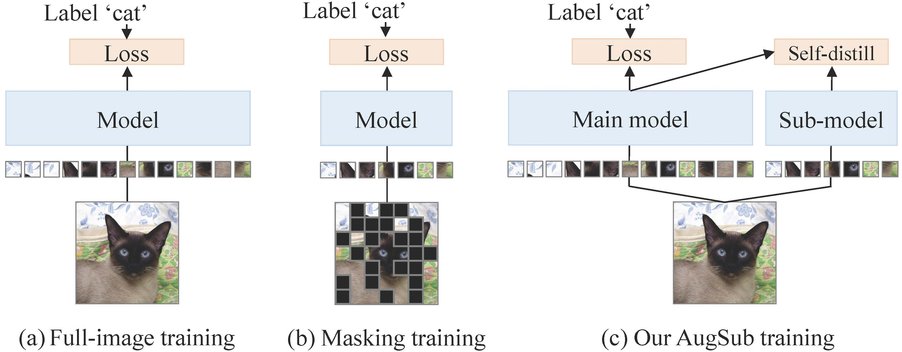

<div align="center">

# Augmenting Sub-model to Improve Main Model

**[Byeongho Heo](https://sites.google.com/view/byeongho-heo/home), [Taekyung Kim](https://tkkim93.github.io/), [Sangdoo Yun](https://sangdooyun.github.io/), [Dongyoon Han](https://sites.google.com/site/dyhan0920/)** <br>

[NAVER AI LAB](https://naver-career.gitbook.io/en/teams/clova-cic/ai-lab)


[](https://arxiv.org/abs/2306.11339)

</div>

Official PyTorch implementation of AugSub "Augmenting Sub-model to Improve Main Model" | [arxiv](https://arxiv.org/abs/2306.11339).

### Abstract

Image classification has improved with the development of training techniques. However, these techniques often require careful parameter tuning to balance the strength of regularization, limiting their potential benefits. In this paper, we propose a novel way to use regularization called Augmenting Sub-model (AugSub). AugSub consists of two models: the main model and the sub-model. While the main model employs conventional training recipes, the sub-model leverages the benefit of additional regularization. AugSub achieves this by mitigating adverse effects through a relaxed loss function similar to self-distillation loss. We demonstrate the effectiveness of AugSub with three drop techniques: dropout, drop-path, and random masking. Our analysis shows that all AugSub improves performance, with the training loss converging even faster than regular training. Among the three, AugMask is identified as the most practical method due to its performance and cost efficiency. We further validate AugMask across diverse training recipes, including DeiT-III, ResNet, MAE fine-tuning, and Swin Transformer. The results show that AugMask consistently provides significant performance gain. AugSub provides a practical and effective solution for introducing additional regularization under various training recipes.


## Updates

- **Jun 21, 2023**: Codes for deit, mae, swin, and resnet are released
- **Jun 21, 2023**: Arxiv paper is released

## Getting Started

You can find AugSub training command at each folder.

- `deit/`   : DeiT-III training *"DeiT III: Revenge of the ViT"* [original repo](https://github.com/facebookresearch/deit)
- `mae/` : MAE finetuning *"Masked Autoencoders Are Scalable Vision Learners"* [original repo](https://github.com/facebookresearch/mae)
- `swin/` : Swin Transformer training *"Swin Transformer: Hierarchical Vision Transformer using Shifted Windows"* [original repo](https://github.com/microsoft/Swin-Transformer)
- `resnet_rsb/` : ResNet training with RSB recipe *"ResNet strikes back: An improved training procedure in timm"* [original repo](https://github.com/huggingface/pytorch-image-models/tree/v0.5.4)

## Method preview



### Pseudo-code for AugSub
It shows basic mechanism of AugSub with simple code.
```python
# For drop probability p
for (x, y) in data_loader:
    o1, o2 = model(x, drop_prob=0), model(x, drop_prob=p)
    loss = CrossEntropy(o1, y)
    loss += CrossEntropy(o2, softmax(o1.detach()))
    (loss/2).backward()
    optimizer.step()
```

### Practical code for AugMask 50\%
In practice, we use gradient accumulation technique to prevent GPU memory issues. Also, we use `loss_scaler` for mixed precision.
```python
for (x, y) in data_loader:
    optimizer.zero_grad()
            
    # Main model
    outputs = model(x), 
    loss = criterion(outputs, y)
    loss_scaler(loss/2, optimizer, retain_graph=False, update_grad=False)
    
    # Sub-model with masking
    outputs_sub = model(x, augsub='masking', augsub_ratio=0.5)
    loss = criterion(outputs_sub, F.softmax(outputs.detach()))
    loss_scaler(loss/2, optimizer, retain_graph=False, update_grad=True)
```


## Performances

### DeiT-III

| Architecture | # params | FLOPs  | 400 epochs  |    + AugMask    | 800 epochs |    + AugMask    |
|:------------:|:--------:|:------:|:-----------:|:---------------:|:----------:|:---------------:|
| ViT-S/16     | 22.0 M   | 4.6 G  | 80.4        | **81.1 (+0.7)** | 81.4      | **81.7 (+0.3)** |
| ViT-B/16     | 86.6 M   | 17.5 G | 83.5        | **84.1 (+0.6)** | 83.8      | **84.2 (+0.4)** |
| ViT-L/16     | 304.4 M  | 61.6 G | 84.5        | **85.2 (+0.7)** | 84.9      | **85.3 (+0.4)** |
| ViT-H/14     | 632.1 M  | 167.4 G| 85.1        | **85.7 (+0.6)** | 85.2      | **85.7 (+0.5)** |


### MAE finetuning

| Architecture | Finetuning Epochs | Baseline |    + AugMask    |
|:------------:|:-----------------:|:--------:|:---------------:|
| ViT-B/16     | 100               | 83.6     | **83.9 (+0.3)** |
| ViT-L/16     | 50                | 85.9     | **86.1 (+0.2)** |
| ViT-H/14     | 50                | 86.9     | **87.2 (+0.3)** |


### Swin Transformer

| Architecture | # Params | FLOPs | Baseline |    + AugMask    |
| :---: | :---: | :---: | :---: |:---------------:|
| Swin-T | 28.3 M | 4.5 G | 81.3 | **81.4 (+0.1)** |
| Swin-S | 49.6 M | 8.7 G | 83.0 | **83.4 (+0.4)** |
| Swin-B | 87.9 M | 15.4 G | 83.5 | **83.9 (+0.4)** |


### ResNet

| Architecture | # Params | FLOPs | Baseline |    + AugMask    |
| :---: | :---: | :---: | :---: |:---------------:|
| ResNet50 | 25.6 M | 4.1 G | 79.7 | **80.0 (+0.3)** |
| ResNet101 | 44.5 M | 7.9 G | 81.4 | **82.1 (+0.7)** |
| ResNet152 | 60.2 M | 11.6 G | 81.8 | **82.8 (+1.0)** |


## License

Licensed under [CC BY-NC 4.0](LICENSE)

```
AugSub
Copyright (c) 2023-present NAVER Cloud Corp.
CC BY-NC-4.0 (https://creativecommons.org/licenses/by-nc/4.0/)
```

## How to cite

```
@article{heo2023augsub,
    title={Augmenting Sub-model to Improve Main Model},
    author={Heo, Byeongho and Kim, Taekyung and Yun, Sangdoo and Han, Dongyoon},
    year={2023},
    journal={arXiv preprint arXiv:2306.11339},
}
```
